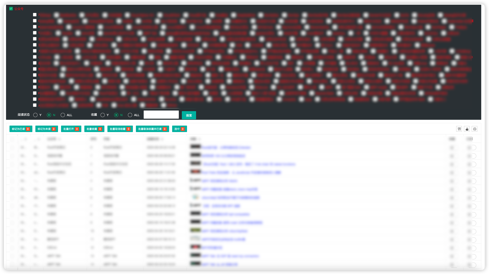
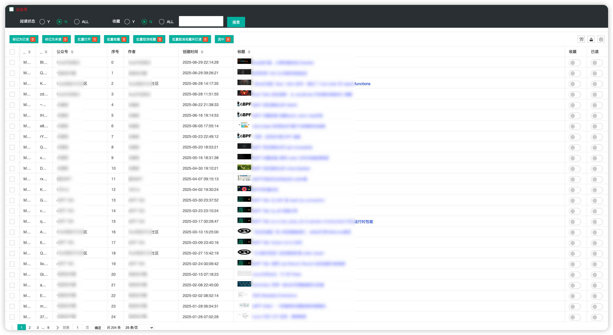
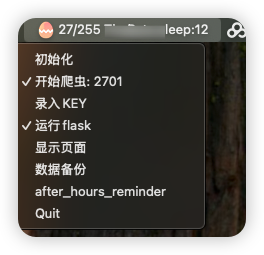

# 微信公众号文章爬取与管理系统

本项目旨在实现对微信公众号文章的自动化爬取、存储与管理，并提供可视化的Web界面进行数据浏览和操作。

## 主要功能

- **自动化爬虫**：通过模拟请求，自动批量抓取指定微信公众号的文章信息。
- **数据存储**：将抓取到的文章、账号等信息存入本地MySQL数据库，支持断点续爬。
- **Web管理界面**：基于Flask实现的前端页面，支持文章的筛选、收藏、已读标记等操作。
- **备份与提醒**：支持数据备份、下班提醒等实用功能。
- **跨平台支持**：支持Mac平台的菜单栏应用集成。

## 系统架构

- `main.py`：主入口，集成爬虫、Web服务、菜单栏应用等功能。
- `sub/crawl.py`：爬虫核心逻辑，实现文章抓取、断点续爬、异常处理等。
- `sub/server.py`：Web服务，提供数据接口和前端页面。
- `insert.py`：数据库操作相关。
- `images/`：项目相关的界面截图或示意图。

## 部分界面预览







## 快速开始

1. 安装依赖：`pip install -r requirements.txt`
2. 启动MySQL服务（可用docker，详见main.py自动化部分）
3. 运行主程序：`python main.py`
4. 访问Web界面或使用菜单栏应用进行操作

## 打包
- python3 setup.py py2app -O2
---

## 配置
```
{
    "Host": "i.weread.qq.com",
    "accept": "*/*",
    "channelid": "AppStore",
    "vid": "329107044",
    "basever": "9.3.1.37",
    "v": "9.3.1.37",
    "skey": "WTxaXfsL",
    "user-agent": "WeRead/9.3.1 (iPad; iOS 18.5; Scale/2.00)",
    "accept-language": "zh-Hans-CN;q=1",
}

{
    "host":"wechat",
    "port":18889,
    "user":"root",
    "password":"",
    "database":"wechat",
    "charset":"utf8mb4"
}

需要再运行开始，抓包获取

```

如有问题请联系作者。
